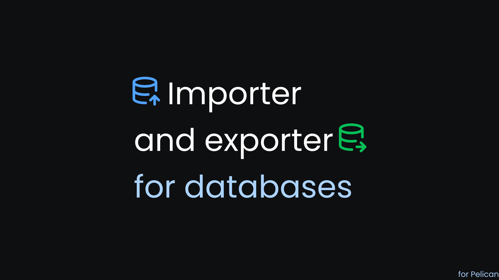

# Database Import/Export Plugin

Export and import your Pelican Panel server databases directly from the panel interface.

## Features

- **Export databases** to SQL files with automatic download
- **Import SQL files** back into your databases
- **Security**: Automatic filtering of dangerous SQL commands (CREATE DATABASE, CREATE USER, GRANT, etc.)
- **Compatible**: MySQL & MariaDB support
- One-click operations directly from the databases table
- Automatic cleanup of temporary files
- Permission-based access control
- Detailed logging of import/export operations

## Security Features

### Automatic SQL Filtering

The plugin **automatically blocks** dangerous SQL statements during import:

- `CREATE DATABASE` / `DROP DATABASE`
- `CREATE USER` / `DROP USER`
- `GRANT` / `REVOKE` privileges
- `USE database` statements

This prevents malicious SQL files from:
- Creating unauthorized databases
- Creating new users
- Granting elevated privileges

### "The SQL File must be a file of type..."
Make sure you're uploading a valid `.sql` file. The plugin accepts these MIME types:
- `application/sql`
- `text/plain`
- `text/x-sql`
- `application/x-sql`

## Author

Made by **olivierdti**